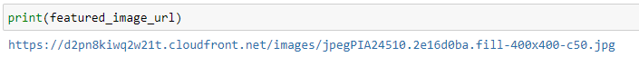
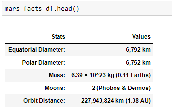
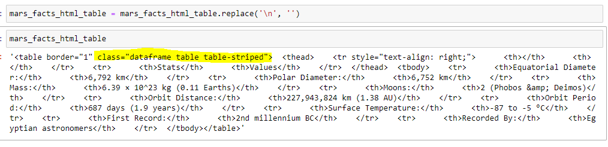
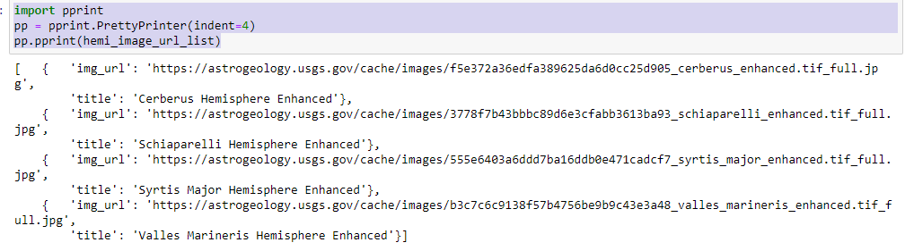
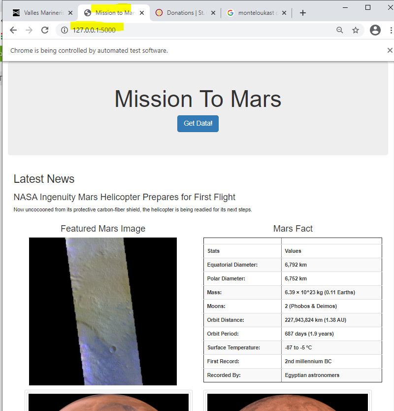
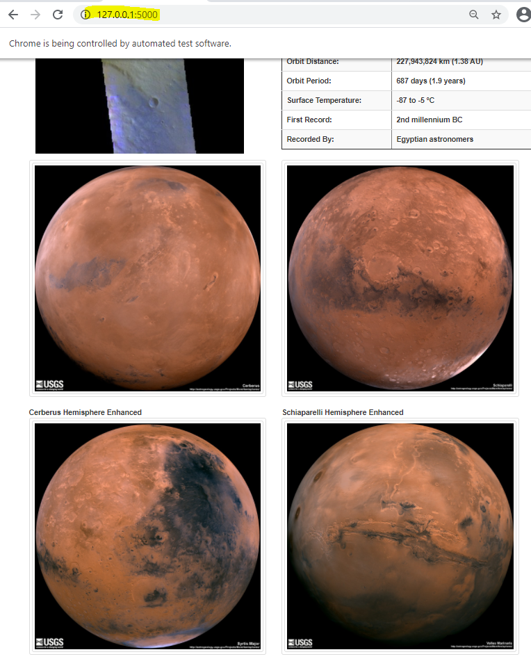

# Mission to Mars Web Scraping Project

>**The following are the project objectives**
1. Scrape Mars website([Site](https://mars.nasa.gov/news/?page=0&per_page=40&order=publish_date+desc%2Ccreated_at+desc&search=&category=19%2C165%2C184%2C204&blank_scope=Latest)) for featured story and paragraph using Beautiful Soup.
2. Utilize Selenium and Beautiful Soup to scrape image URL for featured Mars image, using the following base web page to click through on [Featured Image Base Page](https://www.jpl.nasa.gov/images?search=)
3. Utilize Selenium and Pandas to scrape Mars facts from an HTML table from following web page: [Mars Facts](https://space-facts.com/mars/) and save to a DataFrame.
4. Utilizing Selenium and Beautiful soup scrape the image titles and URL for Mars' four Hemispheres using the following web page to click through on [Image Site](https://astrogeology.usgs.gov/search/results?q=hemisphere+enhanced).
5. All above scraping are compiled into a function that will return the scraped values in a dictionary to be consumed by flask application.
6. Flask application will consist of two endpoints.
 - / - Renders HTML template passing Mars fact dictionary from Mongo Collection.
 - /scrape - Runs function that scrapes JPL website and store return dictionary into Mongo collection.

## Mars Scrape

### Featured Story
Utilizing the following Beautiful Soup and Python code, scraping the featured Mars story and paragraph was very easy:
`html = requests.get(mars_latest_news_url)`
`bs = BeautifulSoup(html.text,'html.parser')`
`results = bs.find("div",class_="slide")`
`paragraph = results.a.text.strip()`
`title = results.find('div',class_="content_title").text.strip()`

### Featured Image
Utilizing Selenium, Beautiful Soup and Python scrape the featured image, which requires web click actions to be scripted in order to pull largest image.
`-browser.visit(mars_gallery_url)`
`browser.find_by_css("input[id=filter_Mars]").first.click()   `
`bs = BeautifulSoup(browser.html,'html.parser')`
`results = bs.find("div",class_="SearchResultCard")`
`browser.click_link_by_href(large_image_html)`
`bs = BeautifulSoup(browser.html,'html.parser')`
`results = bs.find("div",class_= "BaseImagePlaceholder")`
`featured_image_url = results.img['src']`

### Mars Fact HTML Table 
Utilizing Beautiful Soup and Pandas scrape the Mars facts HTML table and store table HTML code into a variable. Found a cool feature of Pandas DataFrames, which is the ability to add style classes to table HTML code generated by DataFrame function to_html.
`html = requests.get(mars_facts_url)`
`df = pd.read_html(html.text)`
`mars_facts_df = df[0]`
`cols = ["Stats", "Values"]`
`mars_facts_df.set_axis(cols,axis="columns",inplace=True)`
`mars_facts_df.set_index(["Stats","Values"],inplace=True)`

DataFrame to HTML
`mars_facts_html_table = mars_facts_df.to_html(classes=["table","table-striped"])`
`mars_facts_html_table = mars_facts_html_table.replace('\n', '')`

### Gather Images of Mars Four Hemisphers
Utlinzing Selenium click through to base web page.  Use Beautiful Soup to return list of URL's to click through on in order scrape the full resolution image URL's of each of the hemispheres.

`browser.visit(mars_hemisphers_url)`
`bs = BeautifulSoup(browser.html,'html.parser')`
`results = bs.find_all('div', class_="item")`
`hemi_image_url_list = []`
`for result in results:`
`    hemi_dict = {}`
`    link = result.a['href'].strip()`
`    title_url = result.h3.text`
`    browser.visit(site_base + link)`
`    bs = BeautifulSoup(browser.html,'html.parser')`
`    res = bs.find('img',class_='wide-image')`
`    img_url = site_base + res['src']`
`    hemi_dict = {"title":title_url, "img_url":img_url}`
`    hemi_image_url_list.append(hemi_dict)`

### Resulting Dictionary
`final_dict = {`
`    "LatestNewsTitle": title,`
`    "LatestNewsParagraph":paragraph,`
`    "FeatureImageUrl": featured_image_url,`
`    "MarsFactHtml":mars_facts_html_table,`
`    "HemispherImageUrlList":hemi_image_url_list`
`}`
The above dictionary consists of mainly string values except for HemispherImageUrlLIst, which is a list of dictionaries consisting image title and image address.  The MarsFactHtml item consists of table HTML.

##Python Flask
Utilizing Flask create the endpoints that will initiate the scrape process/function to store Mars data into Mongo database, as well as render HTML from template using Mars data stored in Mongo collection.

`@app.route("/")`
`def index():`
`    mars_info = mongo.db.mars_info.find_one()`
`    return render_template("index.html", mars_info=mars_info)`
`
`
`@app.route("/scrape")`
`def scraper():`
`    mars_info = mongo.db.mars_info`
`    mars_data = scrape_mars.scrape()`
`    mars_info.update({}, mars_data, upsert=True)`
`    return redirect("/", code=302)`

An index.html file located in templates folder will consume the dictionary (mars_info) to render each of the values.  The only tricky coding was to generate the HTML table using the HTML string, which was not rendering intially.  A **safe** attribute needed to be added to variable:

    

      <h3  class="text-center">Mars Fact</h3>
      

        {{mars_info.MarsFactHtml|safe}}
      
        
    

Using the safe attribute saved me time from converting DataFrame to list of dictionaries to create a table dynamically within templare index.html.

However, I utilize a **foreach** to gearate the **div** containers for the four Mars hemisphere images.

## Resulting Web Screenshots

**Screenshot 1**

**Screenshot 2**

